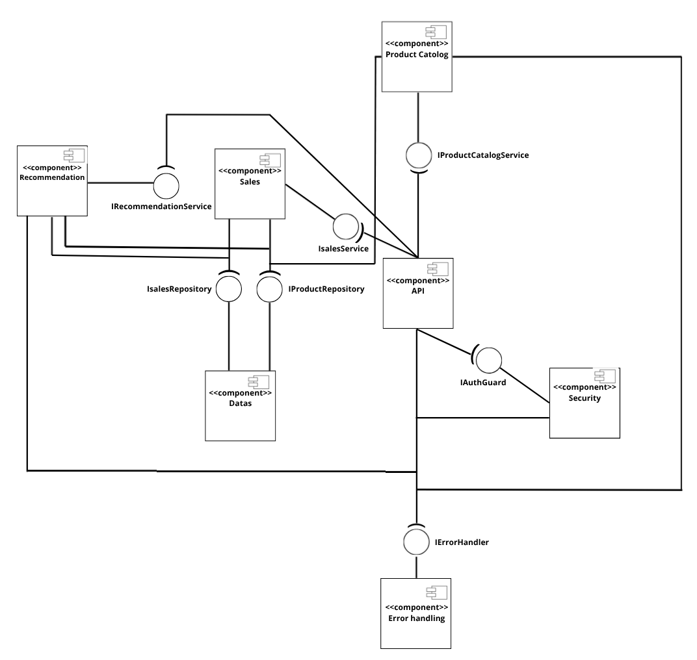
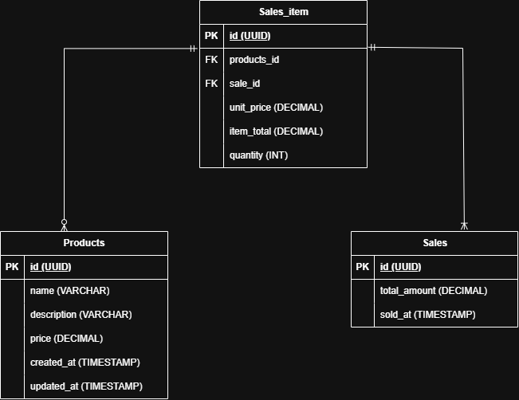

# Question 1

Voici la liste des modules que j’ai identifié en me basant sur l’énoncé et les users storys :

## Module Product Catalog

Il a pour responsabilité de gérer le cycle de vie des produits (création, modification, listing et consultation).

Il a des interactions avec les modules suivants : **API**, **Sales** et **Recommendation**.

Il existe des flux entrants qui correspondent aux demandes de création, modification ou encore consultation de produit.

En sortie, le produit existe en base de données et ses informations sont consultables et manipulables.

Concernant les dépendances, le module a besoin d’un accès à la base de données (`RepositoryProduct`).

---

## Module API

Il a pour responsabilité d’exposer les endpoints et d’assurer les échanges entre les **DTO** et l’applicatif.

Il a des interactions avec les modules suivants : **Product Catalog**, **Sales** et **Recommendation**.

Il existe des flux entrants qui correspondent à des requêtes HTTP (format JSON).

En sortie, les informations sont transmises au client via des réponses HTTP.

Concernant les dépendances, le module a besoin d’accéder aux DTO et aux services applicatifs.

---

## Module Recommandation

Il a pour responsabilité de générer une suggestion de produits à partir du catalogue et de l’historique.

Il a des interactions avec les modules suivants : **Sales** et **Product Catalog**.

Il existe des flux entrants qui correspondent aux demandes de recommandation.

En sortie, une liste de produits est consultables.

Concernant les dépendances, le module a besoin d’une interface `RecommendationStrategy` et des repositorys de **Sales** et **Product Catalog**.

---

## Module Sales

Il a pour responsabilité d’enregistrer les ventes ainsi que les informations associées.

Il a des interactions avec les produits.

Il existe des flux entrants qui correspondent aux commandes réalisées par les utilisateurs ou le souhait de consultation des informations de ventes.

Les flux entrants correspondent aux commandes de création de vente et aux demandes de consultation.

Les flux sortants correspondent à l’enregistrement de la vente en base de données et la possibilité de la consultation de ses informations.

Concernant les dépendances, ce module s’appuie sur `SaleRepository`, `SaleLineRepository` et `ProductRepository`.

---

## Module Security

Il a pour responsabilité d’assurer l’authentification et l’autorisation sur les endpoints sensibles.

Il interagit avec le module **API** en interceptant les requêtes avant l’exécution des contrôleurs.

Les flux entrants correspondent aux requêtes HTTP contenant les informations d’authentification.

Les flux sortants correspondent soit à un contexte utilisateur autorisé, soit à un refus d’accès.

Concernant les dépendances, ce module s’appuie sur les composants de sécurité Spring et les différentes règles de rôles.

---

## Module Error Handling

Il a pour responsabilité de centraliser le traitement des exceptions et de normaliser les réponses d’erreur.

Il interagit avec tous les modules applicatifs via la capture des exceptions.

Les flux entrants correspondent aux exceptions déclenchées pendant le traitement des requêtes.

Les flux sortants correspondent à des réponses JSON standardisées avec le code HTTP cohérent.

Concernant les dépendances, ce module s’appuie sur les classes d’exceptions métier et les mécanismes de gestion d’erreurs Spring.

---

## Module Data

Il a pour responsabilité d’encapsuler l’accès à la base relationnelle et le mapping ORM.

Il interagit avec les modules suivants : **Product Catalog**, **Sales** et **Recommendation**.

Les flux entrants correspondent aux opérations de lecture et d’écriture demandées par les services.

Les flux sortants correspondent aux entités persistées et aux résultats de requêtes.

Concernant les dépendances, ce module s’appuie sur JPA/Hibernate et la base de données relationnelle.

# Diagramme UML (composants)

# Critères de qualité

## Évolutivité

Les modules sont définis avec un découpage permettant de limiter le nombre d’opérations et de modules à modifier lors d’une évolution du code.

J’ai utilisé des interfaces afin que les modules communiquent entre eux via des abstractions. Cela permet de remplacer facilement certaines implémentations sans impacter l’ensemble du système.

Concernant la sécurité et la gestion des erreurs, j’ai choisi de créer deux modules séparés afin d’externaliser ces traitements et de conserver une meilleure séparation des responsabilités.

---

## Robustesse

Le module **Security** permet de protéger les endpoints API critiques.

Le module **Error Handling** permet de retourner des erreurs dans un format JSON standardisé, facilement accessible et compréhensible par les développeurs.

L’utilisation d’interfaces permet de diminuer le couplage entre les modules et de limiter les potentielles régressions.

Enfin, l’attribution d’un rôle unique par module permet de favoriser la cohérence ainsi qu’une meilleure séparation des responsabilités de chaque composant.

---

## Testabilité

L’utilisation d’interfaces permet de réaliser facilement des mocks au niveau des dépendances, ce qui facilite l’écriture et la maintenance des tests.

Le découpage en modules distincts permet également de mieux isoler les composants et de faciliter la détection des problèmes lors de l’exécution des tests.

# Question 2

# Schéma base de données (Module Sales)

## 1) Creer une vente
- Methode: POST
- URL: /api/sales

## 2) Lister les ventes
- Methode: GET
- URL: /api/sales

## 3) Detail d'une vente
- Methode: GET
- URL: /api/sales/{id}

# Question 3

J'ai choisi de mettre en place une sécurisation au niveau de l'API via un système d'authentification par JWT Bearer.
J'utilise Keycloak pour la génération des tokens. Spring Security Resource Server est en charge de la vérification des tokens générés par ce dernier. J'ai mis en place deux niveaux de rôles pour gérer les différentes permissions. Le rôle "ADMIN" permet de réaliser des opérations d'écriture sensibles et le rôle USER permet de réaliser de simples consultations.  

Configuration JWT via variables d'environnement:
- `SPRING_SECURITY_OAUTH2_RESOURCESERVER_JWT_ISSUER_URI`
- `KEYCLOAK_ADMIN`
- `KEYCLOAK_ADMIN_PASSWORD`

Concernnant les retours API, j'ai mis en place un format JSON standard.
L'uniformisation du format est réalisée via ErrorResponse.java.
Code 400: (Bad request)  Requête invalide
Code 401: (Unauthorized) Accès non autorisé lorsque l'authentification est manquante ou invalide 
Code 403: (Forbidden) Accès interdit car rôle insuffisant
Code 404: (Not found) La ressource est absente
Code 500:  (Internal Server Error) Erreur côté serveur

## Question 4

Le périmètre fonctionnel du module de recommandation repose sur deux sources de données. La première source est l'historique des ventes, stocké dans les tables SALES et SALE_ITEMS, qui permet d'observer les produits achetés ensemble dans les transactions passées. La seconde source est le catalogue de produits, stocké dans la table PRODUCTS, qui permet de filtrer et d'enrichir les résultats pour ne recommander que des produits existants (via nom + identifiant).

Le module "Recommendation" produit deux types de recommandations selon le contexte. Lorsque le paramètre productId est fourni, le système génère des recommandations de produits associés au produit de référence, à partir des achats simulatanés observés dans l'historique. Lorsque productId n'est pas fourni, le système renvoie une sélection de produits de type "best-sellers", dans le but de proposer des articles populaires même sans contexte précis.

### Algorithme ML 

L'algorithme implémenté est un algorithme de règles d'association, inspiré de l'approche de type Apriori sur des paires de produits. Son objectif est de détecter des relations utiles de la forme X vers Y, ce qui signifie que la présence de X dans un panier augmente la probabilité d'acheter Y. Tout d'abord, chaque vente est transformée en transaction contenant un ensemble de produits. Ensuite, le module calcule les fréquences d'apparition des produits seuls et des paires de produits. Ces informations permettent d'obtenir les éléments statistiques nécessaires à l'évaluation des règles.

J'utilise trois mesures qui permettent d'établir les recommandations:

1. Support: fréquence d'apparition d'un produit ou paire de produits dans l'ensemble de l'historique.
2. Confidence: Correspond à la probabilité d'observer un produit A quand un produit B est déjà présent.
3. Lift: Forcé réélle de la relation entre les produits A et B par rapport au hasard. 

J'ai mis en place les seuils minimum suivants:
1. Support = 0.05
2. Confidence = 0.15
3. Lift = 1.00

Le module conserve uniquement les règles qui dépassent les différents seuils minimaux, ce qui permet d'écarter les associations jugées moins pertinentes. Les produits sont ensuite classés avec un score. Le moteur retourne alors les n meilleurs résultats, avec une stratégie de fallback qui propose des produits de type "best-sellers" ou des produits du catalogue lorsque l'historique est insuffisant ou losrqu'aucune règle exploitable n'est disponible.
